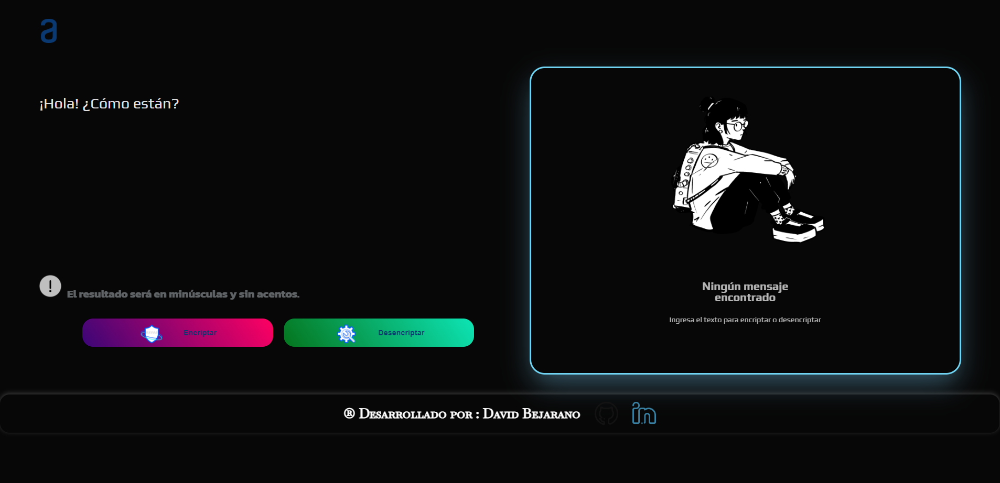
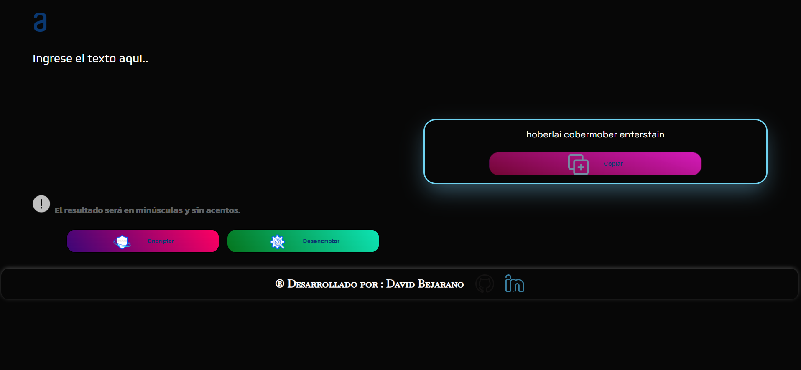
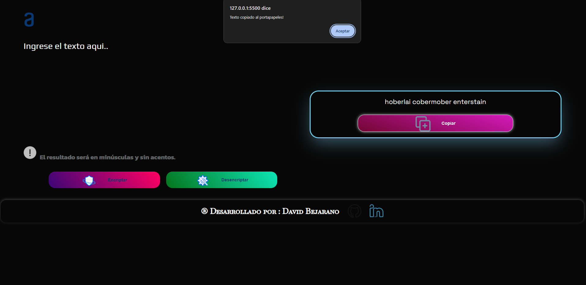
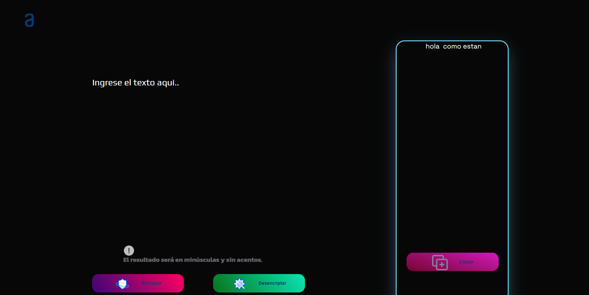

# Encriptador de Texto 🔐

## Descripción

Este proyecto es un encriptador de texto simple que convierte caracteres específicos en secuencias especiales según las reglas establecidas. Es ideal para ocultar mensajes simples y experimentar con técnicas básicas de encriptación y desencriptación.

## Características

- **Encriptación**: Convierte vocales en secuencias de texto predefinidas para encriptar mensajes.
- **Desencriptación**: Restaura el texto encriptado a su forma original.
- **Copiar al portapapeles**: Permite copiar el texto encriptado.
- **Interfaz Responsiva**: Diseño adaptable a diferentes tamaños de pantalla, incluyendo móviles y tabletas.

## Capturas de Pantalla
### Vista en Escritorio


### Encriptar

### copiar el resultado

### pegar el texto encriptado en el campo para desencriptarlo

### texto ya desencriptado


## Tecnologías Utilizadas

- **HTML5**: Estructura básica de la aplicación.
- **CSS3**: Diseño y estilos, incluyendo la responsividad.
- **JavaScript**: Lógica de encriptación, desencriptación y manejo de eventos.

## Instalación

1. Clona este repositorio:

    ```bash
    git clone https://github.com/CalciferD/encriptador-texto1.github.io.git
    ```

2. Navega a la carpeta del proyecto:

    ```bash
    cd encriptador-de-texto
    ```

3. Abre `index.html` en tu navegador favorito para ver la aplicación en acción.

## Uso

1. **Ingresar Texto**: Escribe o pega el texto que deseas encriptar o desencriptar en el área de texto superior.
2. **Encriptar o Desencriptar**: Presiona el botón correspondiente para realizar la acción deseada.
3. **Copiar al Portapapeles**: Utiliza el botón "Copiar" para copiar el resultado.

## Contribuciones

¡Las contribuciones son bienvenidas! Si deseas mejorar el proyecto, siéntete libre de hacer un fork y enviar un pull request con tus cambios.

## Autor

**David Bejarano** - [LinkedIn](https://www.linkedin.com/in/david-bejarano-a1867b301/) - [GitHub](https://github.com/CalciferD)
